# Hydra Dynamics — Website Production SOP
> AI-intercepted pipeline for fast, cost-effective website delivery. Target: 1 site/day per employee.

---

## Pipeline Overview

```
Client Intake → Claude LLM → Aura.build (Page 1) → Design System Extraction → Aura.build (Remaining Pages) → Cursor → Deploy
```

---

## Zones & Responsibilities

| Zone | Tool | Responsibility |
|------|------|----------------|
| Discovery | Claude / Gemini (chat) | Brief, personas, emotional anchoring, section plan, page prompt |
| Build — Page 1 | Aura.build | Free-form first page generation, iteration until approved |
| Design System | Claude / Gemini (chat) | Scan approved HTML, extract design system as JSON |
| Build — Pages 2+ | Aura.build | Constrained generation using design system JSON |
| Integration | Cursor | Astro project, components, SEO, CMS, ecommerce, deploy |

---

## Steps

```mermaid
flowchart TD
  INPUT(["Client Brief + SB7 Answers"])
  FOOTER(["Footer References - footer.design"])

  subgraph P1["PHASE 1 - DISCOVERY - Claude / Gemini"]
    S1["Step 1
    Business Definition
    + Buyer Personas"]
    S15["Step 1.5
    Footer Emotional
    Anchoring"]
    S2["Step 2
    Theme Ideas
    Generation"]
    S3["Step 3
    Theme Definition
    Finalizing"]
    S4["Step 4
    Section Context
    + Content Plan"]
  end

  subgraph P2["PHASE 2 - FIRST PAGE BUILD - Aura.build"]
    S5["Step 5
    Generate Initial Page
    Full creative freedom"]
    S6["Step 6
    Base Layout Setup
    1440px, 4/12px padding"]
    S7["Step 7
    Hand-edit Gaps
    Polish checklist"]
    S8{"Step 8
    Client
    Approves?"}
  end

  subgraph P3["PHASE 3 - DESIGN SYSTEM + REMAINING PAGES - Aura.build + Claude"]
    S9["Step 9
    Extract Design
    System JSON"]
    S10["Step 10
    Generate Remaining
    Pages"]
    S11["Step 11
    Add Reactive
    Elements in Aura"]
  end

  subgraph P4["PHASE 4 - INTEGRATION - Cursor"]
    S12["Step 12
    HTML into Astro Project"]
    S13["Step 13
    Reusable Components
    Nav, Footer, UI"]
    S14["Step 14
    SEO + Crawler + Sitemap"]
    S15b["Step 15
    CMS Payload Endpoints"]
    S16["Step 16
    Ecommerce + Payments"]
    S17["Step 17
    Domain + DNS Setup"]
  end

  subgraph P5["PHASE 5 - QA + DELIVERY"]
    S18["Step 18
    QA Pass
    Forms, CMS, Payments"]
    S19["Step 19
    Deploy to Production"]
    S20["Step 20
    Verify Analytics + GSC"]
    S21["Step 21
    Client Handoff
    Creds, Loom, Scope"]
  end

  INPUT --> S1
  FOOTER --> S15

  S1 -->|"Personas JSON + Business Def"| S2
  S15 -->|"Footer Feeling JSON"| S2
  S2 -->|"Pick 1 theme"| S3
  S3 -->|"Theme Spec JSON"| S5
  S2 -->|"Mediated Market Context JSON"| S4
  S1 -.->|"SB7 + Personas JSON"| S4

  S4 -->|"Section Plan JSON"| S5
  S5 --> S6
  S6 --> S7
  S7 --> S8
  S8 -->|"No - revise"| S7
  S8 -->|"Yes"| S9

  S9 -->|"Design System JSON"| S10
  S4 -.->|"Redo Step 4 per page"| S10
  S10 --> S11
  S11 --> S12
  S12 --> S13
  S13 --> S14
  S14 --> S15b
  S15b --> S16
  S16 --> S17
  S17 --> S18
  S18 --> S19
  S19 --> S20
  S20 --> S21
```



### Phase 1 — Discovery (Claude / Gemini)

- **Step 1** — Business definition + persona generation
- **Step 1.5** — Footer emotional anchoring via [footer.design](https://footer.design)
- **Step 2** — Theme ideas Generation
- **Step 2.5** — Color Palette Finalization
- **Step 3** — Theme definition Generation Finalizing
- **Step 4** — Sections context + content generation

---

### Phase 2 — First Page Build (Aura.build)

- **Step 5** — Generate Initial Page (full creative freedom on buttons, layout, hierarchy)
- **Step 6** — Base Layout Setup (Max-width 1440px, side padding m-4px / t & d 12px)
- **Step 7** — Hand-edit anything missing
- **Step 8** — Iterate until client approves the design direction

---

### Phase 3 — Design System Extraction & Remaining Pages Build

- **Step 9** — Paste HTML into Claude/Gemini, scan and extract design system as JSON
  - Typography (sizes, weights, hierarchy)
  - Color palette + usage rules
  - Background styles
  - Shadows + depth
  - Button styles + states
  - Border radius
  - Image styling conventions
  - Spacing patterns
- **Step 10** — Generate remaining pages repeating step 4 and using extracted design system JSON
- **Step 11** — Generate any missing reactive elements within Aura

---

### Phase 4 — Integration (Cursor)

- **Step 12** — Put HTML within prebuilt Astro project
- **Step 13** — Section reusable components (nav, footer, critical UI)
- **Step 14** — SEO + crawler config + sitemap
- **Step 15** — Add CMS Payload endpoints
- **Step 16** — Add ecommerce Payload sections + payment processor integration
- **Step 17** — Domain + DNS setup

---

### Phase 5 — QA + Delivery

- **Step 18** — QA pass (forms, CMS publishing, payments sandbox, cross-browser)
- **Step 19** — Deploy to production
- **Step 20** — Verify analytics + GSC firing
- **Step 21** — Client handoff (credentials, Loom walkthrough, support scope)

---


# Sections

## Step 1 — Business definition + persona generation

> It’s a classic agency struggle: you’re trying to build a beautiful "ship" (the website), but the client hasn't even decided where they’re sailing. 

To get the SB7 data you need without overwhelming them, focus on these **7 high-impact questions**.

---

### The Minimalist SB7 Discovery List

| SB7 Category | The Question to Ask the Client | Why it matters |
| :--- | :--- | :--- |
| **1. The Hero** | "If your customer could only have **one** specific result from you, what would it be?" | Defines the hero's "want." |
| **2. The Villain** | "What is the single biggest 'bad guy' or annoyance stopping them from getting that result?" | Identifies the Villain. |
| **3. The Problem** | "How does that 'bad guy' make them **feel** (frustrated, scared, overwhelmed)?" | This is the **Internal Problem** (the real reason people buy). |
| **4. The Guide** | "What are 2-3 stats, awards, or big names you’ve worked with that prove you know your stuff?" | Establishes Authority. |
| **5. The Plan** | "What are the 3 simplest steps a customer takes to go from 'Stranger' to 'Finished Product'?" | Creates the "Path to Success." |
| **6. The Stakes** | "What happens to their life or business if they **don't** hire you?" | Identifies the Failure to avoid. |
| **7. The Success** | "What does their 'happily ever after' look like physically and emotionally?" | Visualizes the win. |

---

#### Three Tips for "Extraction"

* **The "Rule of One":** Clients often want to list 10 things they do. Force them to pick **one** hero and **one** villain per landing page. If they try to be everything to everyone, they become nothing to no one.
* **The "Internal" is the Gold:** If they say, *"We fix leaky pipes,"* (External), ask, *"And how does a homeowner feel when their basement is flooding?"* (Internal). They'll say, *"They feel out of control and terrified of the bill."* **That** is what you write the website copy about.
* **Keep the Plan to Three:** Even if their process is 15 steps, condense it into three on the website. 
    1. *Book a Consult.*
    2. *We Create Your Plan.*
    3. *Enjoy Your Results.*
    *(People's brains can only track about three things before they tune out.)*

> **Quick Reality Check:** If your client can't answer "How does your customer feel?", they don't have a marketing problem; they have a business model problem. You might need to help them invent a persona just so the website has a "target" to hit.

---

#### Three Tips for "Extraction"

* **The "Rule of One":** Clients often want to list 10 things they do. Force them to pick **one** hero and **one** villain per landing page. If they try to be everything to everyone, they become nothing to no one.

---

### The Prompt

```
You are a brand strategist building a website brief for a web development agency.

Using the SB7 data below, generate [persona_count] buyer personas for this business. 
The two personas must represent distinct segments — do not create two versions of the 
same person (e.g. one B2B vs B2C, or budget-conscious vs premium, or decision maker 
vs influencer).

Apply cultural context based on the market field:
- LK: Sri Lankan buyer behavior, price sensitivity, trust signals, mobile-first habits
- GCC: Gulf buyer behavior, premium expectations, formality, WhatsApp-driven decisions
- LK+GCC: Generate one persona per market
- International: Neutral western buyer assumptions

Where client_confidence is "high": stay close to the client's exact words.
Where client_confidence is "medium": fill gaps with reasonable assumptions, mark 
each assumed field with a "assumed": true flag.
Where client_confidence is "low": construct personas primarily from the villain and 
internal_problem fields, invent what's missing, and mark ALL persona fields with 
"assumed": true. Add a top-level "confidence_warning" field explaining what was 
inferred.

Return ONLY valid JSON. No explanation, no preamble, no markdown code fences.

Output structure:
{
  "business_definition": "",
  "confidence_warning": "",
  "personas": [
    {
      "name": "",
      "age_range": "",
      "occupation": "",
      "market_context": "",
      "hero_want": "",
      "villain": "",
      "internal_feeling": "",
      "success_vision": "",
      "primary_objection": "",
      "buying_role": "",
      "visual_preference": Specific design styles,
      "brand_voice_direction": Describe the specific vocabulary and tone required to reach this persona,
      copy_hook": A 1-sentence headline that would immediately stop this persona from scrolling,
      "tech_profile": {
        "primary_device": "",
        "internet_speed_context": "",
        "digital_fluency": ""
      },
      "assumed": false
    }
  ]
}

SB7 INPUT:
{
  "business": {
    "name": "",
    "industry": "",
    "market": "",
    "website_type": ""
  },
  "sb7": {
    "hero_want": "",
    "villain": "",
    "internal_problem": "",
    "authority": "",
    "plan_steps": ["", "", ""],
    "failure_stakes": "",
    "success_vision": ""
  },
  "client_confidence": "",
  "persona_count": 2,
  "general_remarks": ""
}

- market field options:"LK" / "GCC" / "LK+GCC" / "International"
- client_confidence options:"high" / "medium" / "low"
```
## Step 1.5 — Footer emotional anchoring

> Take the customer selected footer designs and convert them into json identity by using the below prompts..

---

### The Prompt
```
You are a brand design interpreter.

A client has chosen website footer design(s) that emotionally resonates with their 
brand. Ignore the specific colors, company name, and content in the footer. Focus 
purely on the feeling, personality, and design language it communicates.

Describe what you observe in the following dimensions and return ONLY valid JSON. 
No explanation, no preamble, no markdown code fences.

{
    "layout_density": "Dense/Compact vs. Airy/Spacious",
    "whitespace_feeling": "Luxurious/Minimal vs. Efficient/Utility",
    "typographic_strategy": "Bold/Authoritative vs. Elegant/Thin vs. Technical/Mono",
    "shape_language": "Rounded/Friendly vs. Sharp/Professional vs. Brutalist/Raw",
    "contrast_strategy": "High-impact/Deep vs. Soft/Low-contrast",
    "personality_keywords": [],
    "formality_score": "1-10 (1 = Streetwear/Casual, 10 = Swiss Bank)",
    "visual_complexity": "Flat/2D vs. Layered/Depth/Shadows",
    "motion_expectation": "Snappy/Instant vs. Smooth/Parallax",
    "brand_archetype": "The Ruler, The Creator, The Sage, etc.",
    "design_system_directives": "3 specific rules for the AI builder to follow (e.g., 'Use thin 1px borders only')""layout_density": "Dense/Compact vs. Airy/Spacious",
    "whitespace_feeling": "Luxurious/Minimal vs. Efficient/Utility",
    "typographic_strategy": "Bold/Authoritative vs. Elegant/Thin vs. Technical/Mono",
    "shape_language": "Rounded/Friendly vs. Sharp/Professional vs. Brutalist/Raw",
    "contrast_strategy": "High-impact/Deep vs. Soft/Low-contrast",
    "personality_keywords": [],
    "formality_score": "1-10 (1 = Streetwear/Casual, 10 = Swiss Bank)",
    "visual_complexity": "Flat/2D vs. Layered/Depth/Shadows",
    "motion_expectation": "Snappy/Instant vs. Smooth/Parallax",
    "brand_archetype": "The Ruler, The Creator, The Sage, etc.",
    "design_system_directives": "3 specific rules for the AI builder to follow (e.g., 'Use thin 1px borders only')"
    "target_audience_feel": "",
    "content_placement": "",
    "additional_design_remarks": ""
}

FOOTER DESCRIPTION:
[DESCRIBE THE FOOTER HERE — layout, type style, sections visible, overall impression]
```

## Step 2 — Theme Ideas Generation

> See what types of theme ideas can fit for this website.

---

### The Prompt
```
You are a senior brand and web designer generating 2-3 distinct theme concepts.

INPUTS:
1. SB7 Strategy: The core business narrative.
2. Buyer Personas: Who we are targeting (Visual & Market context).
3. Footer Feeling: The structural/emotional DNA anchor.

YOUR TASK:
Synthesize these into [2-3] distinct visual "worlds."

CONSTRAINTS:
- No generic "Clean/Modern" descriptions. Be specific (e.g., "Industrial Brutalist" or "Soft-Tech Minimal").
- Market Sensitivity: 
  - LK: Optimize for hierarchy and trust; avoid "heavy" visual assets that kill load times.
  - GCC: High-gloss, high-contrast, premium "maximalism" or "Elite-Minimalism."
- Every theme must justify its existence via the "Rationale" field.

OUTPUT:
Return ONLY valid JSON.

{
  "themes": [
    {
      "theme_name": "",
      "mediated_market_context": {
        "primary_cultural_vibe": "e.g., GCC Luxury meets Sri Lankan Reliability",
        "bandwidth_strategy": "e.g., High-end visuals but optimized for mobile/spotty data",
        "trust_signals_required": "e.g., Formal certifications for the GCC buyer, personal testimonials for the LK buyer",
        "visual_bridge": "How the design satisfies both (e.g., 'Using gold accents for premium feel while maintaining a clean, accessible layout for ease of use')"
        },
      "personality_words": [],
      "visual_directives": {
        "typography": "e.g., Serif headers for authority, Mono subheaders for tech feel",
        "color_logic": "e.g., Deep emerald backgrounds with gold accents",
        "shape_language": "e.g., Sharp edges, no rounding, 1px borders",
        "layout_style": "e.g., Asymmetric, bento-grid, or editorial-style"
      },
      "aura_prompt_fragment": {
        "inject": "2-3 sentences of positive visual direction (layout, color, type).",
        "avoid": "1 sentence of negative constraints (e.g., 'Avoid rounded corners, generic blue gradients, or centered body text')."
        },
      "rationale": {
        "persona_fit": "",
        "footer_fit": ""
      }
    }
  ]
}


SB7 STRATEGY:
[PASTE SB7 DATA]

PERSONA INPUT:
[PASTE PERSONAS JSON]

FOOTER FEELING INPUT:
[PASTE FOOTER JSON]
```

## Step 2.5 — Color Palette Finalization

> Lock in the brand's primary and secondary colors before generating the technical spec.

### Instructions:

- Go to www.realtimecolors.com.
- Input the "Primary Color" based on the client’s existing logo (if they have one) or the Theme Idea selected in Step 2.
- Use the "Randomize" or "Optimize" features to find a palette that fits the Mediated Market Context (e.g., Gold/Navy for GCC, or Blue/White for LK).
- Send the unique URL to the client.
- Client Action: Client approves the palette or requests a "warmer/cooler" shift.
- Data Capture: Copy the HEX codes for Primary, Secondary, Background, and Accent.


## Step 3 — Theme Definition Generation Finalizing

> Create the proper theme directive by the chosen theme.

---

### The Prompt
```
You are a Lead Design Systems Architect. You are taking a selected "Theme Concept" and expanding it into a rigid Design Specification for a web builder.

INPUTS:
1. Chosen Theme Concept (Name, Personality, Visual Directives)

YOUR TASK:
Define the "Visual Laws" of this website. These directives must be specific enough that a UI generator cannot deviate from the brand's intent.

Return ONLY valid JSON.

{
  "theme_spec": {
    "brand_name": "",
    "visual_anchor": "One sentence summary of the 'look' (e.g., High-gloss GCC Luxury).",
    "do_not_do": "One sentence of explicit visual anti-patterns for this theme. e.g., No gradients, no rounded hero images, no pastel tones.",
    "typography": {
    "hierarchy_intent": "e.g., Mix editorial serifs with technical mono accents. Freedom to vary styles for labels vs. headlines as long as they feel [Personality].",
    "scaling_logic": "e.g., Dramatic size differences between hero titles and section headers.",
    "creative_latitude": ""
    },
    "layout_philosophy": {
    "structural_vibe": "e.g., Clean and grid-locked but with freedom for overlapping elements and creative whitespace.",
    "density_target": "e.g., Let the sections breathe; prioritize high whitespace over compact information."
    }
    "color_system": {
      "background_logic": "e.g., Alternating pure white and light-gray sections",
      "accent_usage": "e.g., Use the brand primary color ONLY for CTA buttons and icons",
      "text_contrast": "e.g., Use Dark Navy instead of Pure Black for text"
    },
    "component_dna": {
      "border_radius": "e.g., 0px (Sharp) or 12px (Soft/Modern)",
      "button_style": "e.g., Outline buttons for secondary, Solid with shadow for primary",
      "input_fields": "e.g., Underlined only, no boxes",
      "card_style": "e.g., Flat with 1px border, no shadows"
    },
    "aura_master_instruction": "A concentrated 3-sentence 'Master Style' prompt to be prepended to ALL page generations to ensure visual continuity."
  }
}

CHOSEN THEME INPUT:
[PASTE THE SELECTED THEME JSON HERE]
[PASTE THE SELECTED COLOR PALETTE HERE]
```
example input formate for adding selected palette:
```
{
  "theme_spec": {
    ...
    "color_system": {
        "light_mode": {
            "background": "#ffffff",
            "text": "#000000",
            "primary": "",
            "secondary": "",
            "accent": ""
        },
        "dark_mode": {
            "background": "#000000",
            "text": "#ffffff",
            "primary": "",
            "secondary": "",
            "accent": ""
        },
        "contextual_logic": "e.g., Use Light Mode for Hero and Plan sections. Use Dark Mode for Villain and CTA sections to emphasize urgency."
    }
    },
    ...
  }
}
```

## Step 4 — Sections context + content Generation

> Create the page content(text only) and sections suiting for the targetted context by sending the SB7, personas and mediated market context

---

### The Prompt
```
You are a senior website content strategist. Your goal is to map out a high-converting, single-page narrative based on the SB7 framework.

INPUTS:
1. SB7 Strategy (The Story)
2. Buyer Personas (The Audience)
3. Mediated Market Context (The Visual Bridge)

RULES:
- Limit to 6–8 sections. Every section must have a "Strategic Job" (e.g., 'Agitate the Problem').
- Sequential Logic: Follow the SB7 arc: Hero Want -> Villain/Problem -> Guide/Authority -> The Plan -> Success/CTA.
- Market Nuance: 
    - For GCC: High-status headers and outcome-focused subtext.
    - For LK: Proximity to trust signals (testimonials/logos) and clear "How it works" steps.
- DO NOT write final copy. Provide the "Soul" of the content so the UI generator can manifest it.

OUTPUT:
Return ONLY valid JSON. 

{
  "strategic_narrative": "A 1-sentence summary of the page's psychological goal.",
  "page_section_plan": [
    {
      "order": 1,
      "section_name": "e.g., The Stakes Hero / The Guide Introduction",
      "sb7_pillar": "e.g., Villain/Internal Problem",
      "intent": "Explain what the user should FEEL after scrolling this section.",
      "content_brief": {
        "headline_vibe": "The emotional angle for the H1/H2.",
        "key_message": "The single most important fact they must learn here.",
        "cta_intent": "What is the desired next click?"
      },
      "aura_layout_hint": "Intent-based direction (e.g., 'Use a layout that emphasizes a clear 1-2-3 sequence' or 'Use a high-impact visual split to contrast the problem vs solution').",
      "persona_focus": "Which persona trait is this section specifically 'selling' to?"
    }
  ]
}

SB7 INPUT:
[PASTE SB7 JSON]

PERSONAS INPUT:
[PASTE PERSONAS JSON]

MEDIATED MARKET CONTEXT (from Step 2):
[PASTE MEDIATED CONTEXT JSON]
```

## Step 5 — Generate Inital Page

> Create the initial page with Aura, by pasting the theme spec and the section plan json. Directly at Aura.build.

---

### The Prompt

```
You are building a complete website page for a client. You will receive two inputs: 
a Theme Specification that defines the visual laws of this website, and a Section 
Plan that defines the content and narrative purpose of each section.

Your job is to generate the full page in one pass. Follow the Theme Specification 
as a strict visual contract — the aura_master_instruction is your north star for 
every design decision. Follow the Section Plan for content structure and order — 
do not add, remove, or reorder sections.

Give full creative freedom to layout execution, component choices, spacing 
decisions, and visual hierarchy within each section — as long as every decision 
feels consistent with the theme personality. Do not default to generic layouts. 
Make it feel designed.

THEME SPECIFICATION:
[PASTE THEME SPEC JSON HERE]

SECTION PLAN:
[PASTE SECTION PLAN JSON HERE]
```

## Step 6 — Base Layout Setup

> Make sure you change the base layout to this and ensure that AI didn't accidently delete anything else, specially sections.

---

### The Prompt

```
In the generated page, apply the following layout constraints globally:

Set the maximum page width to 1440px, centered.
For all main content wrapper divs within each section, apply side padding:
mobile 4px, tablet and desktop 12px.

Use Tailwind classes only. Do not change any existing styles, colors, spacing, 
or layout decisions. Only apply these constraints, don't remove any other code.
```

## Step 7 — Hand-edit anything missing

> Fix the "AI Hallucinations" and bridge the gap between 90% and 100%.

### The Polish Checklist
1.  **Text Cleanup:** Scan for "Latin" (Lorem Ipsum) or AI-placeholder text like `[Insert Benefit Here]`. Replace them using the **Section Plan (Step 4)**.
2.  **Button Check:** Ensure every button has a hover state and a "dead link" (e.g., `#contact`) so it looks functional to the client.
3.  **Image Logic:** If Aura generated a "weird" AI image (six-fingered humans or blurry faces), swap it with a high-quality asset from Unsplash or the client's folder.
4.  **The "Squint Test":** Squint your eyes at the screen. Does the **CTA (Call to Action)** stand out? If not, change the button color to the "Accent" defined in the **Theme Spec (Step 3)**.
5.  **Mobile Audit:** Open the "Mobile View." Ensure no headlines are overlapping and the "Plan" (1-2-3 steps) is vertically stacked and readable.

> **Intern Tip:** Do not redesign. **Fix.** If you spend more than 20 minutes on a single section, stop and ask a senior.

---

## Step 8 — Iterate until client approves

> Get a "YES" without falling into a "Revision Loop" that kills the 24-hour deadline.

## Step 9 — Design System Extraction & Remaining Pages Build

> Make sure you change the base layout to this and ensure that AI didn't accidently delete anything else, specially sections.

---

### The Prompt

```
You are a Lead Design Systems Engineer. You will receive the raw HTML of an 
approved, finalized website page. Your job is to reverse-engineer the exact 
design system being used and codify it as a strict, reusable specification.

RULES:
- Scan every element in the HTML. Extract ONLY what is actually present.
- If the HTML uses utility classes (e.g., Tailwind CSS), capture the exact class 
  names (e.g., "text-slate-900", "p-8", "rounded-xl") rather than trying to guess 
  computed hex codes or pixel values.
- Pay close attention to responsive prefixes (e.g., "md:", "lg:") to understand 
  how the design scales.
- If a pattern does not exist in the HTML, omit it entirely.

Return ONLY valid JSON. No explanation, no preamble, no markdown code fences.

{
  "theme_speced_design_system": {
    "typography": {
      "font_families_used": [],
      "hierarchy": [
        {
          "role": "e.g., H1, H2, Body",
          "tag": "",
          "base_classes": "e.g., text-4xl font-bold tracking-tight",
          "desktop_classes": "e.g., md:text-6xl",
          "usage_context": ""
        }
      ]
    },
    "color_palette": [
      {
        "element": "e.g., Primary Button, Background, Muted Text",
        "class_or_value": "e.g., bg-emerald-600 or #059669",
        "usage_rule": ""
      }
    ],
    "structural_patterns": {
      "container_max_width": "e.g., max-w-7xl",
      "section_padding_mobile": "e.g., py-12 px-4",
      "section_padding_desktop": "e.g., md:py-24 md:px-8",
      "component_gap": "e.g., gap-6 or gap-8"
    },
    "ui_components": {
      "button_primary": {
        "classes": "e.g., bg-black text-white px-6 py-3 rounded-md hover:bg-gray-800 transition"
      },
      "cards": {
        "classes": "e.g., bg-white border border-gray-200 rounded-xl shadow-sm p-6"
      },
      "images": {
        "classes": "e.g., rounded-2xl shadow-lg object-cover"
      },
      "input_fields": {
        "classes": "e.g., w-full border border-gray-300 rounded-md px-4 py-2 text-sm focus:outline-none focus:ring-2 focus:ring-black"
      }
    },
    "aura_injection_instruction": "A dense, technical 4-5 sentence prompt instructing an AI builder on EXACTLY which classes, colors, radii, and spacing rhythms to use. This must act as a strict CSS straightjacket for all future page generations."
  }
}

HTML INPUT:
[PASTE PAGE HTML HERE]
```

## Step 10 — Generate remaining pages

> Make sure you redo the step 4 for each page sections plan to be built and use that JSON with this prompt.

---

### The Prompt

```
You are building a website page that must be visually consistent with an already 
approved design. You will receive two inputs: a Design System extracted from the 
approved page, and a Section Plan for this specific page.

Follow the Design System as a strict visual contract. The 
aura_injection_instruction is your north star — every component, color, spacing 
decision, and typographic choice must conform to it. Do not introduce new styles, 
new colors, new radii, or new patterns that are not already present in the Design 
System.

Give full creative freedom to layout execution and composition within each section 
— as long as every decision stays within the design system boundaries. Do not 
replicate the exact layout of the first page. Each page should feel like it belongs 
to the same visual family but has its own spatial character.

DESIGN SYSTEM:
[PASTE THEME SPECED DESIGN SYSTEM JSON HERE]

SECTION PLAN:
[PASTE THIS PAGE'S SECTION PLAN JSON HERE]
```
## Step 11 — Generate any missing reactive elements within Aura

> Use your common sense.

---