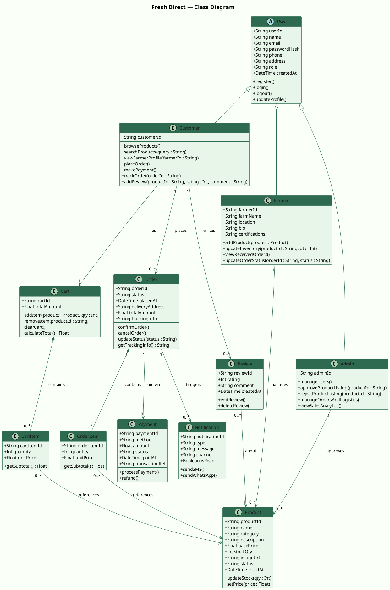

# 🌿 Fresh Direct — PlantUML Code

---

## 1️⃣ CLASS DIAGRAM — PlantUML Code

---

## 2️⃣ USE CASE DIAGRAM — PlantUML Code

```plantuml
@startuml FreshDirect_UseCaseDiagram

skinparam backgroundColor #FAFFF7
skinparam usecase {
    BackgroundColor #E8F5E9
    BorderColor #2D6A4F
    FontColor #1B1B1B
    ArrowColor #2D6A4F
}
skinparam actor {
    BackgroundColor #D4EDDA
    BorderColor #2D6A4F
    FontColor #1B1B1B
}
skinparam rectangle {
    BackgroundColor #F0FFF4
    BorderColor #52B788
}
skinparam title {
    FontSize 18
    FontStyle Bold
}

title Fresh Direct — Use Case Diagram

' ─────────────────────────────────────────
' ACTORS
' ─────────────────────────────────────────
actor "Customer"           as Customer   #2D6A4F
actor "Farmer / Vendor"    as Farmer     #B7950B
actor "Admin"              as Admin      #5E3B8C
actor "Payment Gateway\n(LANKAQR/Card/COD)" as PayGW  #1D4E89
actor "Notification Service\n(WhatsApp/SMS)"  as Notify #0F4C75
actor "Analytics\n(Recharts)"               as Analytics #3A3A3A

' ─────────────────────────────────────────
' SYSTEM BOUNDARY
' ─────────────────────────────────────────
rectangle "🌿 Fresh Direct System" {

    ' ── Common ──────────────────────────
    usecase "Register / Login"   as UC_Login
    usecase "Authentication"     as UC_Auth

    ' ── Customer ────────────────────────
    usecase "Search & Browse Products"  as UC_Browse
    usecase "View Farmer Profiles"      as UC_ViewFarmer
    usecase "Manage Shopping Cart"      as UC_Cart
    usecase "Place Order"               as UC_Order
    usecase "Make Payment"              as UC_Payment
    usecase "Track Order"               as UC_Track
    usecase "Add Reviews & Ratings"     as UC_Review

    ' ── Farmer ──────────────────────────
    usecase "Manage Product Listings"   as UC_ManageProducts
    usecase "Update Inventory"          as UC_Inventory
    usecase "View Received Orders"      as UC_ViewOrders

    ' ── Admin ───────────────────────────
    usecase "Manage Users"              as UC_ManageUsers
    usecase "Approve Product Listings"  as UC_Approve
    usecase "Manage Orders & Logistics" as UC_Logistics
    usecase "View Sales Analytics"      as UC_Analytics
}

' ─────────────────────────────────────────
' CUSTOMER ASSOCIATIONS
' ─────────────────────────────────────────
Customer --> UC_Login
Customer --> UC_Browse
Customer --> UC_ViewFarmer
Customer --> UC_Cart
Customer --> UC_Order
Customer --> UC_Payment
Customer --> UC_Track
Customer --> UC_Review

' ─────────────────────────────────────────
' FARMER ASSOCIATIONS
' ─────────────────────────────────────────
Farmer --> UC_Login
Farmer --> UC_ManageProducts
Farmer --> UC_Inventory
Farmer --> UC_ViewOrders

' ─────────────────────────────────────────
' ADMIN ASSOCIATIONS
' ─────────────────────────────────────────
Admin --> UC_Login
Admin --> UC_ManageUsers
Admin --> UC_Approve
Admin --> UC_Logistics
Admin --> UC_Analytics

' ─────────────────────────────────────────
' EXTERNAL SYSTEM ASSOCIATIONS
' ─────────────────────────────────────────
UC_Payment  --> PayGW
UC_Track    --> Notify
UC_Analytics --> Analytics

' ─────────────────────────────────────────
' INCLUDE RELATIONSHIPS
' ─────────────────────────────────────────
UC_Login  .> UC_Auth          : <<include>>
UC_Order  .> UC_Cart          : <<include>>
UC_Payment .> UC_Order        : <<include>>

' ─────────────────────────────────────────
' EXTEND RELATIONSHIPS
' ─────────────────────────────────────────
UC_Track  .> UC_Order         : <<extend>>
UC_Review .> UC_Order         : <<extend>>
UC_Approve .> UC_ManageProducts : <<extend>>

@enduml
```

---

## 📌 How to Use

| Tool | How to Run |
|------|-----------|
| **PlantUML Online Editor** | Go to [https://www.plantuml.com/plantuml/uml/](https://www.plantuml.com/plantuml/uml/) and paste the code |
| **VS Code** | Install **PlantUML extension** → Right click → Preview |
| **IntelliJ IDEA** | Install **PlantUML Integration** plugin |
| **draw.io** | Import PlantUML via Extras → Edit Diagram |
